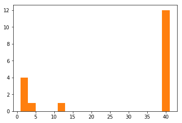
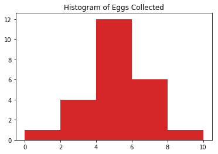
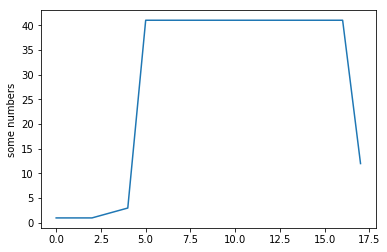
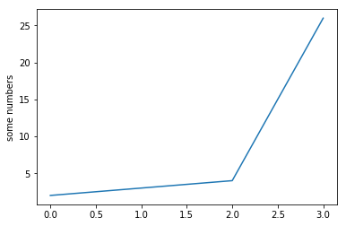

##Test Notebook for working with Pandas and Numpy


```python
import numpy as np

list1 = (1, 1, 1, 2, 3, 41, 41, 41,41, 41, 41,41, 41, 41,41, 41, 41, 12)
list2 = (2, 3, 4, 26)
total = np.sum(list1)
total2 = np.sum(list2)

plt.plot([total, total2])
plt.ylabel('some numbers')
plt.show()
```





```python
import pandas as pd
import numpy as np
df = pd.read_excel("/Users/leithhawkins/Desktop/Project Plan/panda.xlsx")
#, parse_cols = "A"
df

list(df['Number_Eggs'].groupby(df['Collected By']))

df['Number of Eggs Collect'].groupby(df['Collected By']).describe()


```


<div>
<style>
    .dataframe thead tr:only-child th {
        text-align: right;
    }

    .dataframe thead th {
        text-align: left;
    }

    .dataframe tbody tr th {
        vertical-align: top;
    }
</style>
<table border="1" class="dataframe">
  <thead>
    <tr style="text-align: right;">
      <th></th>
      <th>count</th>
      <th>mean</th>
      <th>std</th>
      <th>min</th>
      <th>25%</th>
      <th>50%</th>
      <th>75%</th>
      <th>max</th>
    </tr>
    <tr>
      <th>Collected By</th>
      <th></th>
      <th></th>
      <th></th>
      <th></th>
      <th></th>
      <th></th>
      <th></th>
      <th></th>
    </tr>
  </thead>
  <tbody>
    <tr>
      <th>Annette</th>
      <td>2.0</td>
      <td>4.500000</td>
      <td>0.707107</td>
      <td>4.0</td>
      <td>4.25</td>
      <td>4.5</td>
      <td>4.75</td>
      <td>5.0</td>
    </tr>
    <tr>
      <th>Bill</th>
      <td>2.0</td>
      <td>5.000000</td>
      <td>2.828427</td>
      <td>3.0</td>
      <td>4.00</td>
      <td>5.0</td>
      <td>6.00</td>
      <td>7.0</td>
    </tr>
    <tr>
      <th>Chuck</th>
      <td>2.0</td>
      <td>4.500000</td>
      <td>0.707107</td>
      <td>4.0</td>
      <td>4.25</td>
      <td>4.5</td>
      <td>4.75</td>
      <td>5.0</td>
    </tr>
    <tr>
      <th>God</th>
      <td>1.0</td>
      <td>4.000000</td>
      <td>NaN</td>
      <td>4.0</td>
      <td>4.00</td>
      <td>4.0</td>
      <td>4.00</td>
      <td>4.0</td>
    </tr>
    <tr>
      <th>Leith</th>
      <td>3.0</td>
      <td>4.666667</td>
      <td>2.309401</td>
      <td>2.0</td>
      <td>4.00</td>
      <td>6.0</td>
      <td>6.00</td>
      <td>6.0</td>
    </tr>
    <tr>
      <th>Lexi</th>
      <td>2.0</td>
      <td>5.000000</td>
      <td>0.000000</td>
      <td>5.0</td>
      <td>5.00</td>
      <td>5.0</td>
      <td>5.00</td>
      <td>5.0</td>
    </tr>
    <tr>
      <th>Marty</th>
      <td>4.0</td>
      <td>4.000000</td>
      <td>2.160247</td>
      <td>1.0</td>
      <td>3.25</td>
      <td>4.5</td>
      <td>5.25</td>
      <td>6.0</td>
    </tr>
    <tr>
      <th>Raphy</th>
      <td>4.0</td>
      <td>6.250000</td>
      <td>1.707825</td>
      <td>4.0</td>
      <td>5.50</td>
      <td>6.5</td>
      <td>7.25</td>
      <td>8.0</td>
    </tr>
    <tr>
      <th>Tanya</th>
      <td>3.0</td>
      <td>3.000000</td>
      <td>1.000000</td>
      <td>2.0</td>
      <td>2.50</td>
      <td>3.0</td>
      <td>3.50</td>
      <td>4.0</td>
    </tr>
    <tr>
      <th>Tracey</th>
      <td>1.0</td>
      <td>5.000000</td>
      <td>NaN</td>
      <td>5.0</td>
      <td>5.00</td>
      <td>5.0</td>
      <td>5.00</td>
      <td>5.0</td>
    </tr>
  </tbody>
</table>
</div>


```python
import pandas as pd
import numpy as np
import matplotlib.pyplot as plt
df = pd.read_excel("/Users/leithhawkins/Desktop/Project Plan/panda.xlsx")
x = df.Number_Eggs.tolist()
bins = [0, 2, 4, 6, 8, 10]
plt.title('Histogram of Eggs Collected')
plt.hist(x, bins)
plt.show()

```

    [1, 2, 3, 4, 5, 6, 6, 6, 7, 3, 2, 4, 5, 6, 7, 8, 4, 5, 4, 5, 4, 5, 5, 4]





```python
import matplotlib.pyplot as plt
plt.plot(list)
plt.ylabel('some numbers')
plt.show()
```





## graph of List Variable


```python
import matplotlib.pyplot as plt
plt.plot(list2)
plt.ylabel('some numbers')
plt.show()
```




