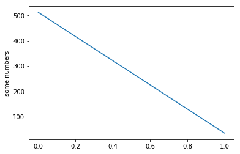
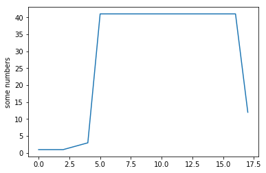
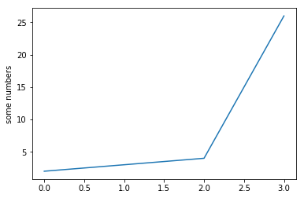

```python
import numpy as np

list = (1, 1, 1, 2, 3, 41, 41, 41,41, 41, 41,41, 41, 41,41, 41, 41, 12)
list2 = (2, 3, 4, 26)
total = np.sum(list)
print (total)
total2 = np.sum(list2)
print(total2)

```

    512
    35


```python
import numpy as np
import matplotlib.mlab as mlab
import matplotlib.pyplot as plt

plt.hist(list, bins=20)
plt.show()
```


```python
import matplotlib.pyplot as plt
plt.plot([total, total2])
plt.ylabel('some numbers')
plt.show()
```





```python
import matplotlib.pyplot as plt
plt.plot(list)
plt.ylabel('some numbers')
plt.show()
```





## graph of List Variable


```python
import matplotlib.pyplot as plt
plt.plot(list2)
plt.ylabel('some numbers')
plt.show()
```




